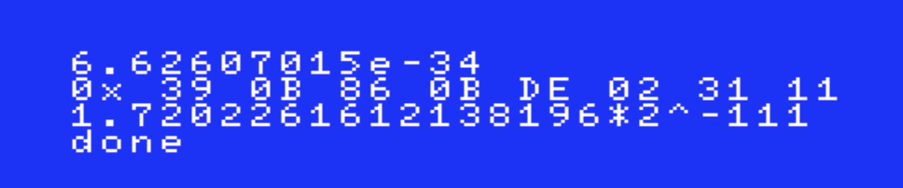

# StringToDouble

This is z80 assembly code that converts a string like

`6.62607015e-34`

into a 64 bit [double-precision floating-point format](https://en.wikipedia.org/wiki/Double-precision_floating-point_format) according to the [IEEE754](https://en.wikipedia.org/wiki/IEEE_754) standard:

`0x 39 0B 86 0B DE 02 31 11`

Also supported is the representation into a power of 2 with the mantisse between 1 and 2:

`1.7202261612138196*2^-111`

In an MSX emulator the output will look like this:



There are no real limitations on the input string as long as it represents a legal floating point string that can be stored in a double precision number (so between DBL\_MIN (2.23e–308) and DBL\_MAX (1.80e+308)). There is however (although only theoretically) a limitation: to calculate the double value an intermediate array of digits is used which has a fixed size of 800 (I copied this value from the [wuffs library](https://github.com/google/wuffs/blob/e80ab7b13ac1e58149a4ad2750b90a7b6a97c123/internal/cgen/base/floatconv-submodule-code.c#L150)). For 'normal' values between 1e-100 and 1e+100 a max of 300 would also suffice. The number of digits needed to calculate numbers close to DBL\_MIN (e.g. 2.2299999999e-308) is 341, and close to DBL\_MAX (e.g. 1.79999999999e+308) is 725. This maximum of 800 can be found in `.digits` in `Double/Double.asm`. There is no check if the program writes beyond this size so this could theoretically break.

There is some validation on the input so in case of invalid input it will result in `Parse error`.

Valid examples include:

* `299792458`
* `00299792458.0000`
* `2.99792458e8`
* `2.99792458e+8`
* `0000.0000299792458000e+0013`
* `-6.62607015e-34`
* `-0.00e+10`

The algorithm I've used is a slightly more efficient version of the so called Simple Decimal Conversion which is explained in [this great article](https://nigeltao.github.io/blog/2020/parse-number-f64-simple.html) written by [Nigel Tao](https://github.com/nigeltao).

The code is (deliberately) incomplete. The following features are missing:

* use of NaN and infinity
* use of the smarter [Eisel-Lemire ParseNumberF64 Algorithm](https://nigeltao.github.io/blog/2020/eisel-lemire.html)

# How to run it?

This code is written as a 16K ROM (the code itself is just under 2.5K) to easily load it into an emulator. To run it in an emulator I've used these tools:

- to compile: [z80asm](https://www.nongnu.org/z80asm/) (version 1.8) written by [Bas Wijnen](https://github.com/wijnen) (also [RUG](https://www.rug.nl/?lang=en) alumni &#1F4AA;)
- to emulate: [WebMSX](https://github.com/ppeccin/webmsx) (version 6.0.3) written by [Paulo Augusto Peccin](https://github.com/ppeccin)

Just download, unpack and configure z80asm the usual way. It can be installed anywhere but the makefile in this repo expects the z80asm-1.8 directory to be in the same directory as this repo.

Then compile the code with:

`make`

You now have a fresh `data.rom`.

Clone WebMSX anywhere you want. WebMSX works out of the box if you load `<install path of WebMSX>/release/stable/6.0/standalone/index.html` in your favorite browser.

To load the ROM I append the following url parameters to this url:

* MACHINE=MSX2E    (I still have this machine in my basement)
* FAST_BOOT=1      (because I like fast)
* WEB\_EXTENSIONS\_PROXY_SERVER=  (this is to avoid using a proxy server)
* ROM=http://localhost/data.rom  (the actual rom)

As you can see in the last line I use a webserver (apache) and `localhost` to load the `data.rom` binary (but of course you can serve it from any place). To make this happen I created `/etc/apache2/other/webmsx.conf` (I use a mac, you might find your apache configuration files elsewhere). You may also need to uncomment or add this line into your `httpd.conf`:

`Include /etc/apache2/other/*.conf`

or wherever you have the configuration.

The content of `webmsx.conf` is (you may need to enable modules in `httpd.conf` to make this work):

```
DocumentRoot [your install path to the StringToDouble repo]

<Directory [your install path to the StringToDouble repo]>
 Header set Access-Control-Allow-Origin "*"
 FileETag None
 Header unset ETag
 Header set Cache-Control "max-age=0, no-cache, no-store, must-revalidate"
 Header set Expires "Wed, 12 Jan 1980 05:00:00 GMT"
 Header set Pragma "no-cache"
 Require all granted
</Directory>
```

These directives will disable the cache since we want to (down)load the binary every time we make a change to the code.

Restart your apache with: 

`sudo apachectl restart`

So the complete url looks like this:

`<install path of WebMSX>/release/stable/6.0/standalone/index.html?MACHINE=MSX2E&FAST_BOOT=1&WEB_EXTENSIONS_PROXY_SERVER=&ROM=http://localhost/data.rom`

That's it.